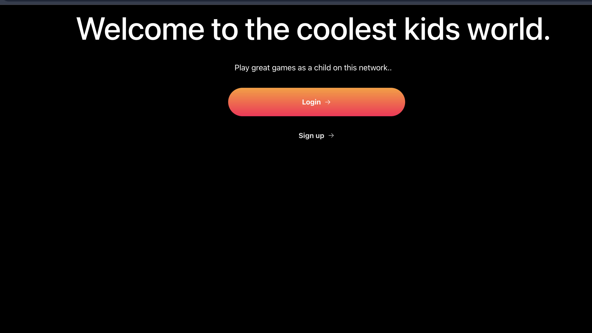
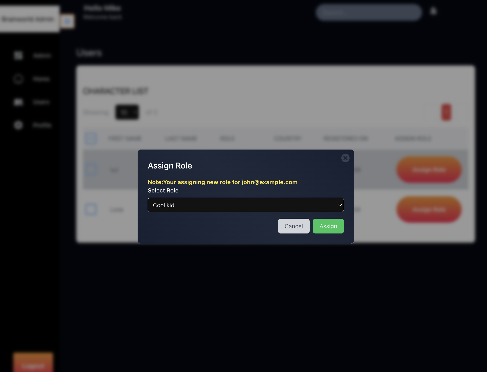
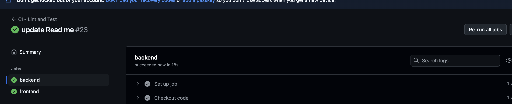

# **Read.md**

 
## **Problem Statement**

The task is to implement a proof-of-concept app called **“Cool Kids Network”**, which involves the following features:

### **System Architecture and Design Pattern**

### PHP(Laravel) - Backend

- I used service-repo pattern to ensure clear seperations of concern
- This also ensures testability of each layer
- This also ensures clean code and best practices that follows SOLID and KISS principles

### React- Frontend

- I follow a react hooks designs to promote resusability of logic accross components
- This also ensures testability of components

### **System Overview**

## **Features in the app **

- Users Dashboard
- Profile Page to update profile
- Users page to list users, only users with admins, cooler kid , or coolest kid role can see this link

- Admin Dashboard (only maintainers can see this, they can also assign roles)
  

## Tech Stack

Backend: Laravel
Frontend: React
Authentication: JWT (JSON Web Tokens)
API: RESTful API
Database: MySQL or SQLite
Character Generation: randomuser.me API

## Checks on CI/CD

    Laravel Test and React Test passes for both front end and backend

  

## Installation

Prerequisites
PHP >= 8.2
Composer
Node.js and npm
MySQL or SQLite
Laravel >= 9.x

1. Clone the repository:

   ```bash
   git clone https://github.com/arinzehills/cool-kids-network.git
   cd cool-kids-network
   ```

2. Backend - PHP(LARAVEL)

   ```bash
   cd backend
   composer install
   php artisan serve
   ```

   Setting up your env. variable

   ```bash
     cp .env.example .env
     php artisan key:generate
    php artisan jwt:secret
    php artisan migrate
   ```

   To run Test

   ```bash
   php artisan test
   ```

## Frontend (React)

Navigate to the frontend directory:

```bash
cd ../frontend
```

Install the dependencies:

```bash
npm install
```

Run Test:

```bash
npm test
```

Start the React development server:

```bash
npm run dev
```

## API Documentation

The API endpoints for the application are structured as follows:

POST /api/register
Registers a new user.
Requires the email field.
Returns a JWT token on successful registration.
POST /api/login
Authenticates a user and returns a JWT token.
Requires email and password fields.
GET /api/users
Fetches all users’ data (admin only).
Returns a list of users with their roles, emails, and character data.
GET /api/user
Fetches the current user's character data.
Only accessible by the logged-in user.
PUT /api/user
updateProfile current user's character data.
Only accessible by the logged-in user.
POST /api/admin/assign-role
Admin can update the role of a user.
Requires a valid JWT token and the role field (Cool Kid, Cooler Kid, Coolest Kid).
